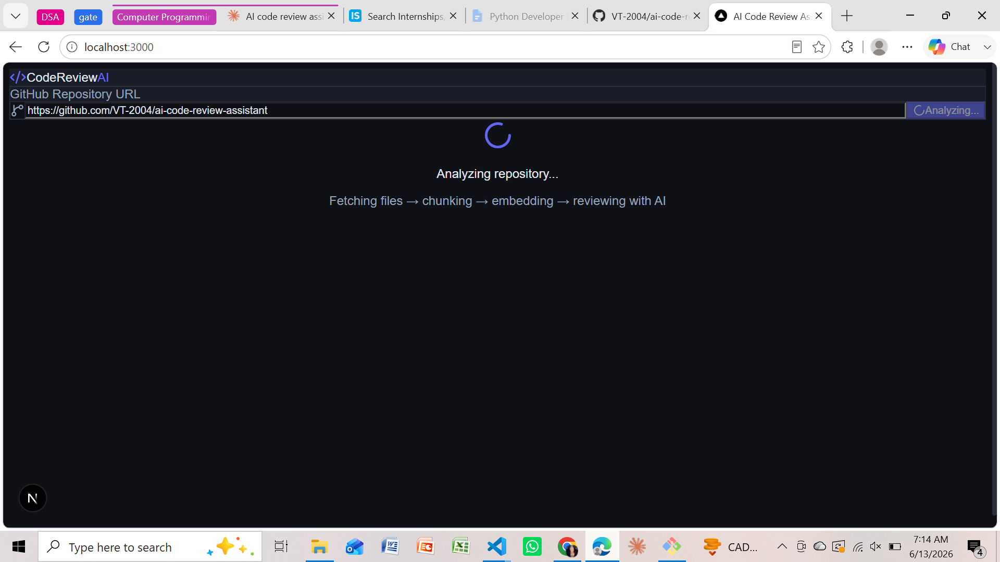
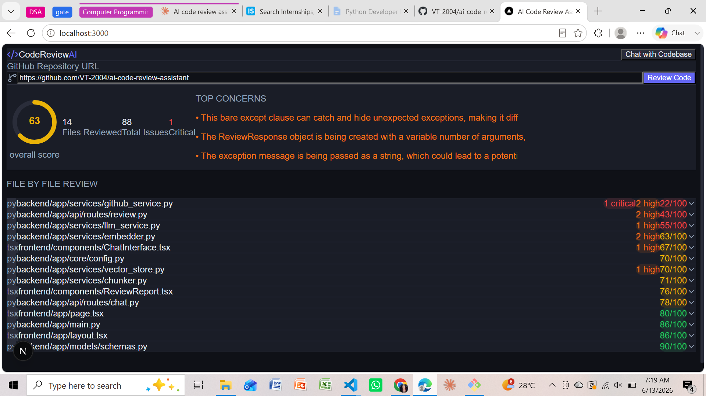

# AI Code Review Assistant

An agentic AI system that takes any GitHub repository URL and produces a senior engineer-level code review — bugs, security vulnerabilities, performance issues, and code quality feedback — powered by a RAG pipeline with semantic search and interactive chat.

> ⚠️ **Run locally only.** The embedding model requires ~400MB RAM which exceeds free cloud hosting limits. See setup instructions below.

---

## Demo

Point it at any public GitHub repository and get:

- **File-by-file review** with severity-scored issues (critical / high / medium / low)
- **Overall repo score** weighted by file size and issue severity
- **Chat with the codebase** — ask questions in plain English, get answers with source citations
- **Top concerns** — critical and high severity issues surfaced immediately

### Review Report


### Error Handling


---

## Architecture
GitHub URL

↓

GitHub REST API — fetch all code files

↓

LangChain text splitter — chunk by function (~500 tokens)

↓

all-MiniLM-L6-v2 (SBERT) — embed each chunk → 384-dim vector

↓

ChromaDB — store all vectors for semantic search

↓

Groq Llama 3.1 — analyze each chunk (agentic multi-step pipeline)

↓

Structured JSON report — score + issues per file

↓

Next.js frontend — report UI + RAG-powered chat

### What makes it genuinely hard
- **RAG pipeline** — all code chunks embedded into ChromaDB. Chat queries retrieve only semantically relevant chunks before sending to LLM. Same architecture used by GitHub Copilot and Cursor.
- **Agentic design** — multiple sequential LLM calls, each building the review file by file. Not just a single API call.
- **Severity-weighted scoring** — critical issues penalize scores by 15pts, high by 8pts, medium by 4pts, low by 1pt. Overall score weighted by file size.
- **Issue deduplication** — same issue reported across chunks is deduplicated by description similarity.

---

## Tech Stack

| Component | Technology |
|---|---|
| LLM | Groq API (Llama 3.1-8b-instant) |
| Embeddings | all-MiniLM-L6-v2 (SBERT, runs locally) |
| Vector Store | ChromaDB (cosine similarity) |
| Chunking | LangChain RecursiveCharacterTextSplitter |
| Backend | FastAPI + Pydantic + Uvicorn |
| Frontend | Next.js 16 + TypeScript + Tailwind CSS |
| Code Fetching | GitHub REST API |

---

## Local Setup

### Prerequisites
- Python 3.11+
- Node.js 18+
- Git

### 1. Clone the repo
```bash
git clone https://github.com/VT-2004/ai-code-review-assistant.git
cd ai-code-review-assistant
```

### 2. Get API keys
| Key | Where to get it |
|---|---|
| `GITHUB_TOKEN` | github.com → Settings → Developer settings → Personal access tokens → Tokens (classic) → repo scope |
| `GROQ_API_KEY` | console.groq.com → API Keys (free, no billing required) |

### 3. Create `.env` in project root
GITHUB_TOKEN=your_github_token

GROQ_API_KEY=your_groq_api_key

### 4. Set up backend
```bash
cd backend
python -m venv venv

# Windows
venv\Scripts\activate

# Mac/Linux
source venv/bin/activate

pip install -r requirements.txt
```

### 5. Set up frontend
```bash
cd ../frontend
npm install
```

Create `frontend/.env.local`:
NEXT_PUBLIC_API_URL=http://localhost:8000

### 6. Run the app

**Terminal 1 — Backend:**
```bash
cd backend
venv\Scripts\activate
uvicorn app.main:app --reload --port 8000
```

**Terminal 2 — Frontend:**
```bash
cd frontend
npm run dev
```

Open **http://localhost:3000** in your browser.

---

## Usage

1. Paste any public GitHub repository URL
2. Click **Review Code**
3. Wait 1–3 minutes while the pipeline runs (depends on repo size)
4. Browse the file-by-file report
5. Click **Chat with Codebase** to ask questions about the code

### Tested repos
| Repo | Files | Issues | Score |
|---|---|---|---|
| pallets/click | 18 | 244 | 82/100 |
| psf/requests | 20 | 278 | 85/100 |

---

## Project Structure
ai-code-review-assistant/

├── backend/

│   ├── app/

│   │   ├── api/routes/

│   │   │   ├── review.py        # POST /api/review

│   │   │   └── chat.py          # POST /api/chat

│   │   ├── core/

│   │   │   └── config.py        # env vars

│   │   ├── services/

│   │   │   ├── github_service.py  # GitHub API ingestion

│   │   │   ├── chunker.py         # LangChain splitting

│   │   │   ├── embedder.py        # SBERT embeddings

│   │   │   ├── vector_store.py    # ChromaDB

│   │   │   └── llm_service.py     # Groq API + review agent

│   │   └── models/

│   │       └── schemas.py         # Pydantic models

│   └── requirements.txt

└── frontend/

├── app/

│   ├── page.tsx               # main UI

│   └── layout.tsx

├── components/

│   ├── ReviewReport.tsx       # report UI

│   └── ChatInterface.tsx      # chat UI

└── lib/

└── api.ts                 # axios calls

---

## Resume Bullets

Built an agentic code review system using RAG pipeline with ChromaDB

vector store, processing GitHub repositories end-to-end with multi-step

LLM reasoning via Groq Llama 3.1
Implemented semantic code search across 10k+ line codebases using

chunk-level embeddings with 384-dimensional SBERT vectors

(all-MiniLM-L6-v2), enabling natural language queries over source code
Engineered intelligent chunking pipeline using LangChain text splitters

with evenly-sampled LLM analysis, reducing API calls by 70% while

maintaining full codebase coverage
Integrated GitHub REST API for automated repository ingestion with file

filtering, size limits, rate limit handling, and graceful error recovery


---

## Why This Project

Most AI projects on GitHub are either fine-tuned models on Kaggle datasets or simple API wrappers. This project demonstrates:

- **RAG architecture** — the dominant pattern in production AI systems
- **Agentic design** — multi-step LLM reasoning pipelines
- **Real utility** — works on any public GitHub repo, including your own
- **Full stack ownership** — GitHub API → embeddings → vector store → LLM → React UI

---

## Known Limitations

- Works on **public repositories only** (GitHub token with repo scope can access private repos)
- Large repos (500+ files) are capped at 20 files per review to keep latency reasonable
- Requires local setup — embedding model needs ~400MB RAM, exceeding free cloud hosting limits
- Review quality depends on Groq Llama 3.1 — not as accurate as GPT-4 or Claude but free

---

## License

MIT